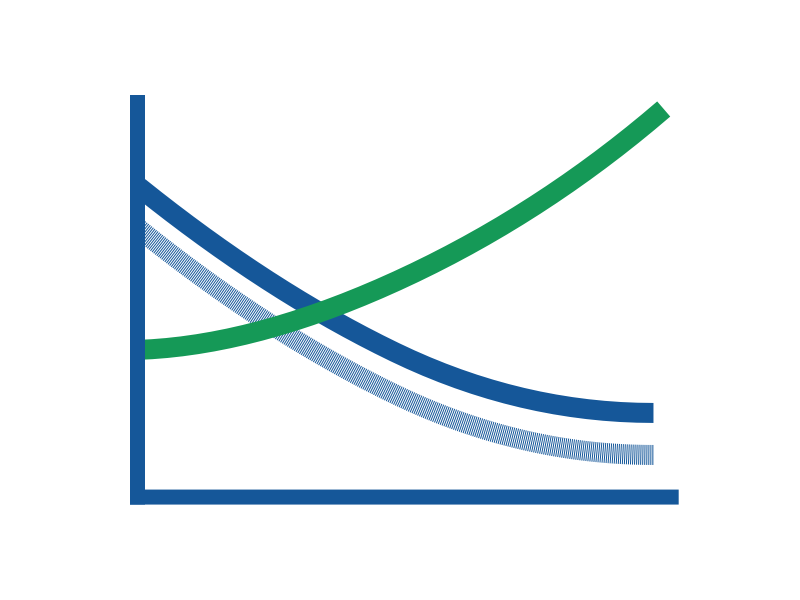

>The world’s population is ageing. Improvements in health care in the past century have contributed to people living longer and healthier lives. However, this has also resulted in an increase in the number of people with non-communicable diseases, including dementia.

*Dr Margaret Chan (1947 - )*  
*Former Director-General of World Health Organization[1](#1)*  

>Unless we find ways to prevent or cure Alzheimer’s and other severe dementing diseases, the world will shortly be confronted with … the epidemic of the 21st century.

*Dr Robert Butler (1927 - 2010)*  
*Gerontologist, psychiatrist, and Pulitzer Prize winner[2](#2)*  

----------------------------

## Introduction

The statements above present an eminent challenge we are facing in this century. Despite its potential disastrous impacts on the society, little public attention and awareness have been placed in the disease.  

One of the reasons for the lack of public awareness is that the loss of memory is usually perceived as a normal process of ageing. In fact, it is an abnormality and could be a sign of Dementia, which leads to a progressive decline of cognitive functions. Unlike patients with cancers or heart diseases, people with dementia endure long-lasting symptoms and become heavily dependent on caregivers. As of now, dementia can't be prevented or cured, but the risks of developing it can be reduced and early intervention prepares the patients and those surrounding them for the progression of the disease.  

With the population structure shifting to become more aged, the prevalence of dementia will continue to rise in the short future, especially in low and middle income countries (LMICs). In 2015, the estimated number of people with dementia in LMICs was 27.8 millions, and it is projected to reach 89.3 millions in 2050, which is approximate to an increase of 227 % (a more than three-fold increase). While in high income countries (HICs), there were about 19.5 millions in 2015 with a forecast of 116 % increase to 42.2 millions in 2050.[3](#3)  

Currently, there are numerous global efforts led by World Health Organization (WHO)[4](#4) and other collaborative forces to promote care for people with dementia, risk reduction and research for cures. Many HICs have national plans to tackle dementia in place, while other countries are developing their plans. Immense efforts are required to curb the epidemic of the 21st century. 

## Motivation

We will endeavour to find evidence and quantitative data to support the two statements mentioned in the beginning, which includes the following claims along with their data sources:

- the world’s population is ageing  
*Data:* [UN World Population Prospects](https://esa.un.org/unpd/wpp/Download/Standard/Population/)
- people living longer and healthier lives (better cures for cancers and heart diseases)  
*Data:* [UN World Population Prospects](https://esa.un.org/unpd/wpp/Download/Standard/Population/), [Global Health Data Exchange](http://ghdx.healthdata.org/gbd-results-tool), [Global Burden of Disease](https://vizhub.healthdata.org/gbd-compare/)
- an increase in the number of people with non-communicable diseases, including dementia  
*Data:* [World Alzheimer Report 2015](https://www.alz.co.uk/research/WorldAlzheimerReport2015.pdf), which is based on [Prince *et al*., 2013](https://doi.org/10.1016/j.jalz.2012.11.007) (the most popular latest systematic review and metaanalysis on this topic)
- the world will shortly be confronted with the *epidemic* of the 21st century  
*Data:* [List of Epidemics](https://en.wikipedia.org/wiki/List_of_epidemics)

Then, we will tell a story of the prevalence of dementia supported by interactive data visualisation. The objective would be to raise the public awareness of the disease by using engaging visual medium, which also allows them to further explore the data interactively. We would like to have visualisations with high impact, yet simple to glance at.  

As people usually have strong emotion to place they have connection to (Boomsma, 2017?), it is our intent to tell stories of some specific countries, e.g., Denmark (HIC), the UK (HIC), and Thailand (Upper middle income country, UMIC), on top of the global picture.

## Proposed visualisation

The audience will be the general public, who are assumed to no prior knowledge about dementia or medical terms.  

The narrative model of visualisation will be hybrid, consisting of an interactive slideshow in a form of scroller, and a possibility to drill down the story with inital global picture that allows user the reader to select a specific country.  

The visualisation will start with a global choropleth map showing the absolute number, the proportion, and the % change of people with dementia of each country from now to 2050. It should transition over years automatically with a possibility for the reader to move a slider to select a particular year.

The reader can choose to read a story of either the world or a specific country. Then, the following visualisation Document will be Driven with appropiate Data powered by Data-Driven Documents (D3.js).

The story is then based on the two statments mentioned earlier. In a scroller format, we will have a series of visualisations and a couple of sentences explaining each visulation on its side, similar to these examples, [1](http://vallandingham.me/scroll_demo/) and [2](https://www.bloomberg.com/graphics/2015-measles-outbreaks/). We are evaluating (advice appreciated) two libraries, [a library built specifically for d3.js scroller](https://github.com/vlandham/scroll_demo) and [a more popular general purpose one](http://imakewebthings.com/waypoints/).

- the world’s population is ageing: population pyramids with transition effect between the current year and future years.

  

- people living longer and healthier lives: line plots of life expectancy, number of death from cancers, number of death from heart diseases over years

  

- an increase in the number of people with non-communicable diseases, including dementia: line plot of number of people with dementia over years 

- the world will shortly be confronted with the *epidemic* of the 21st century: plot comparing the prevalence of dementia with number of deaths of selected epidemics

----------------------------

### Ref:
1. [Dementia: a public health priority](http://apps.who.int/iris/bitstream/10665/75263/1/9789241564458_eng.pdf?ua=1)
2. [The Longevity Revolution: The Benefits and Challenges of Living a Long Life](https://www.goodreads.com/book/show/2972494-the-longevity-revolution)
3. [World Alzheimer Report 2015](https://www.alz.co.uk/research/WorldAlzheimerReport2015.pdf)
4. [Global action plan on the public health response to dementia 2017-2025](http://www.who.int/entity/mental_health/neurology/dementia/action_plan_2017_2025/en/index.html)